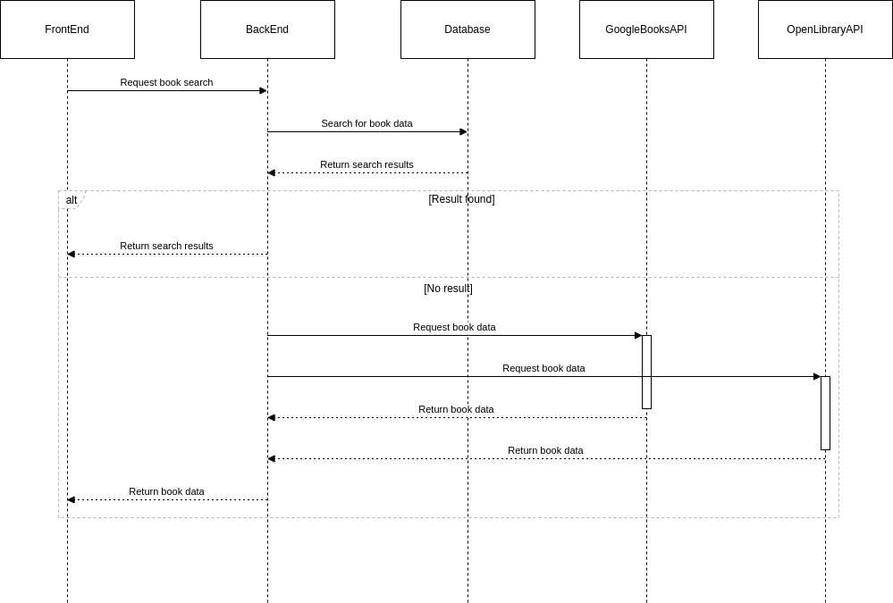

# Library



## Setup

Install Python https://www.python.org/

Version >= 3.10.11

Configure your IDE to use a virtual environment:

```sh
make project/venv
```

Install dependencies:

```shell
make deps/install/full 
```

Start local with a Mysql database:

Install Docker and Docker-compose under your machine

```shell
make docker/compose
```

```shell
./start_local_msql.sh 
```

## Environment Config

### API 

| Name                 | Desc                 | Default     |
|----------------------|----------------------|-------------|
| R5_TOKEN_TTL         | Token Time to Live   | 3600 * 24   |
| R5_LOG               | Logger Level         | INFO        |
| R5_SECRET_KEY        | Session Secret       | Random UUID |
| R5_DATABASE_HOSTNAME | Database Hostname    | None        |
| R5_DATABASE_NAME     | Database Table Name  | None        |
| R5_DATABASE_USER     | Database User        | None        |
| R5_DATABASE_PASSWORD | Database Password    | None        |
| R5_DRIVER            | Database Driver      | None        |


### Compose Ports

| Component | Name | Port Public | Port Internal |
|-----------|------|-------------|---------------|
| Mysql     | msql | 3306        | 3306          |
| This app  | api  | 8080        | 5000          |
